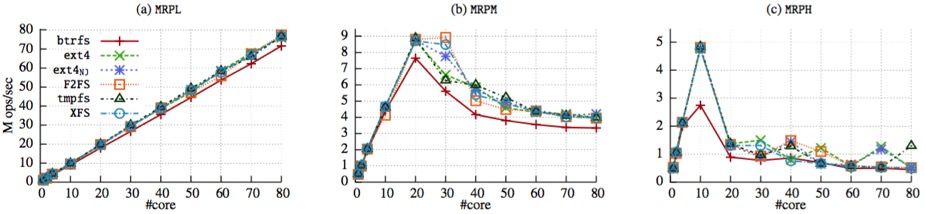

* **可扩展文件系统**
	* [Physical Disentanglement in a Container-Based File System](#osdi14-1)（**`OSDI'14`** `文件系统` `隔离性`）
	* [Understanding Manycore Scalability of File Systems](#atc16-1)（**`ATC'16`** `文件系统`）
* **读写性能测试分析**
	* [Performance Analysis of Containerized Applications on Local and Remote Storage](#msst17-1)（**`MSST'17`** `SSD` `文件系统` `docker存储驱动`）

 
 
 

<h2 id="osdi14-1"></h2>

## Physical Disentanglement in a Container-Based File System

[pdf](http://research.cs.wisc.edu/adsl/Publications/icefs-osdi14.pdf)

> 设计了一个文件系统IceFS，可以将文件和目录分组放入物理隔离的容器(cube)中，不同cube中文件的I/O及数据不会互相影响，从而提高了隔离性：
>  1. 局部化（错误的影响局部化到具体的cube中；错误恢复局部化到具体的cube中，不同cube中事务的提交并行执行）
>  2. 特殊化（可以实现一些定制化。因为每个cube是隔离的，那么每个cube可以使用不同的日志模式，相当于在“性能/一致性”方面提供了一个开关，可以根据负载的不同提供不同的设置

"One aspect of current system design has remained devoid of isolation: the physical on-disk structures of file systems"——文件系统的物理磁盘结构不具有隔离性，比如使用全局的bitmap来维护inode和block，一个bitmap的block出问题，会影响所有该block相关的文件。总的来说，**逻辑独立的文件系统实体并不是物理独立的**，这会导致不理想的可靠性和性能

在进行事务处理时，IceFS对锁进行了优化。性能上的可扩展性好像也主要是对日志系统的优化

 

<h2 id="atc16-1"></h2>

## Understanding Manycore Scalability of File Systems

[pdf](https://www.usenix.org/system/files/conference/atc16/atc16_paper-min.pdf)

> 使用自己开源的benckmark（FxMark）分析5种文件系统的多核扩展性。这5种文件系统（ext4、XFS、btrfs、F2FS、tmpfs）在很多I/O密集型的应用中存在隐藏的可扩展性瓶颈

Introdution部分有提到了当前文件系统的多核可扩展性问题的研究现状（较少），以及研究这个问题的意义

**可扩展性问题**：“For example, all operations on a directory are sequential regardless of read or write; a file cannot be concurrently updated even if there is no overlap in each update. Moreover, we should revisit the core design of file systems for manycore scalability. For example, the consistency mechanisms like journaling (ext4), copy-on-write (btrfs), and log-structured writing (F2FS) are not scalable”

**Exim[8] email server**："The message delivery heavily utilizes I/O operations. It consists of a series of operations ranging from creating, renaming, and deleting small files in the spool directories to appending the message body to the per-user mail file"

  

* (a) 为Exim在6种文件系统下随core增加时的吞吐量。很明显，文件系统限制了Exim应用的多核可扩展性。ext4NJ (i.e., ext4 with no journaling) 相比于ext4有44%的性能下降，原因是在ext4NJ中，2个独立的锁（i.e., a spinlock for journaling and a mutex for directory update）以一种意想不到的方式发生交错。而在ext4中，当调用`create()`创建一个文件时，为了元数据的一致性首先会尝试获取日志的自旋锁，然后获取新建文件所在目录的互斥锁。这种顺序导致了在尝试获取目录互斥锁时，会有较小的竞争，在ext4NJ中，目录互斥锁的大量竞争影响了性能
* 大多数读写操作都在Page Cache中完成，并且大多数写操作能在后台完成。因此，文件系统的内存结构决定了可扩展性，而跟存储介质无关。因此 (b) 中除了XFS，文件系统在不同存储介质下都表现出相似的性能。XFS的性能与存储介质有很大关系，因为XFS中频繁的元数据更新操作会导致日志数据刷新到磁盘，出现等待
* **细粒度锁与可扩展性**：(a) 中btrfs完全没有表现出多核扩展性，并且性能很差。一个猜想是为了等待存储事件的完成，引入了大量空闲时间。但是从图 (c) 中看出btrfs有67%的时间花在了内核模式上。事实上，btrfs为了同步root node，有47%的CPU时间花在了同步更新上。而Btrfs在访问B-tree node时，会有大量锁竞争，从而影响了多核扩展性

> 上述实验和结论说明，对于应用开发者和文件系统开发者来说，要预测推断文件系统的可扩展性是很难的。要识别文件系统的可扩展性，需要有一套benchmark（也就是作者开发的FXMARK Benckmark Suite）来不断地评估并指导文件系统系统的设计

### FXMARK Benckmark Suite

> 实验环境中，每10个core对应1个套接字（这应该是很多测试在10-core之后表现出扩展性问题的原因）

* [5. Microbenchmark Analysis](#5-microbenchmark-analysis)
	* [5.1 Operation on File Data](#51-operation-on-file-data)
		* [5.1.1 Operation on File Data Block Read](#511-operation-on-file-data-block-read)
		* [5.1.2 Block Overwrite](#512-block-overwrite)
		* [5.1.3 File Growing and Shrinking](#513-file-growing-and-shrinking)
		* [5.1.4 File Sync Operation](#514-file-sync-operation)
	* [5.2 Operation on File System Metadata](#52-operation-on-file-system-metadata)
		* [5.2.1 Path Name Resolution](#521-path-name-resolution)
		* [5.2.2 Directory Read](#522-directory-read)
		* [5.2.3 File Creation and Deletion](#523-file-creation-and-deletion)
		* [5.2.4 File Rename](#524-file-rename)
	* [5.3 Scalability in a Direct I/O Mode](#53-scalability-in-a-direct-io-mode)
	* [5.4 Impact of Storage Medium](#54-impact-of-storage-medium)
* [6. Application Benchmarks Analysis](#6-application-benchmarks-analysis)
* [7. Summary of Benchmarks](#7-summary-of-benchmarks)
* [9. Related Work](#9-related-work)

### 5. Microbenchmark Analysis

19 microbenchmarks are designed for systematically identifying scalability bottlenecks. **stressing 7 different components of file systems**

* 1）path name resolution
* 2）page cache for buffered I/O
* 3）inode management
* 4）disk block management
* 5）file offset to disk block mapping
* 6）directory management
* 7）consistency guarantee mechanism

  

#### 5.1 Operation on File Data

#### 5.1.1 Operation on File Data Block Read

  

图 b）中，当多个进程读一个共享文件中的私有块时，XFS出现扩展性问题。原因是XFS通过共享模式(`down_read()`和`up_read()`)访问文件时，会请求和释放 read/write semaphore。一个 read/write semaphore 内部维护了1个 reader counter ，因此共享模式下每个操作都原子地更新 reader counter

图 c）中，当多个进程读一个共享文件中的共享块时，都出现扩展性问题。因为大量的时间消耗在了page cache的引用计数操作上

#### 5.1.2 Block Overwrite

  

图 a) 中，当多个进程写各自私有文件中的一个块时，仅有数据块和inode的属性会被更新，因此按理应该表现出良好的扩展性。但是btrfs、ext4、F2FS没有表现出良好扩展性

* 对于ext4来说，这是因为日志事务的处理过程中存在锁竞争。不同于ext4，XFS使用了 delayed logging，它可以最小化日志写
* 而F2FS的写操作最终会触发 segment cleaning(or garbage collection) 来回收无效的块。segment cleaning 会占用一个文件系统范围的 read/write semaphore ，从而冻结其它文件系统操作
* btrfs使用了cow，因此写操作会分配新块，因此磁盘块的分配（比如，更新extent tree）变成了顺序化瓶颈

图 b) 中，当多个进程写一个共享文件的私有块时，没有哪个文件系统能表现出扩展性。这种情况下，瓶颈是inode互斥锁(inode->i_mutex)。这种顺序化瓶颈源于特定文件系统的实现，而不是VFS。因为测试的这几个文件系统都没有实现一种“范围”锁，这种锁在并发式文件系统[81]中是十分常见的，由于没有“范围”锁，因此只能使用一个粒度更大的文件级别的锁，即inode互斥锁。这个问题对于可扩展I/O密集型应用如DBMS来说，是一个严重的限制

#### 5.1.3 File Growing and Shrinking

  

* 在F2FS中，分配或释放磁盘块会引起2个数据结构的更新：SIT(段信息表，用于跟踪block的可用性)和NAT(节点地址表，用于跟踪inode和block的映射表)。这两个数据结构的更新产生了竞争，因此限制了扩展性
* 在btrfs中，当扩充一个文件时，瓶颈在检查和预留空闲空间；当缩减一个文件时，瓶颈在于更新 extend tree。extend tree 维护了磁盘块的引用计数，引用计数的改变需要更新到根节点的整条路径
* 在ext4和XFS中，为了减少文件碎片，延迟分配技术会将块分配推迟到writeback。因此，对于ext4和XFS，瓶颈不是块分配，而是日志机制。ext4在操作JBD2共享数据结构上耗费了大量时间，XFS在等待日志buffers刷新上耗费了大量时间
* 在tmpfs中，检查容量限制是瓶颈。随着已用空间接近容量限制，检查操作采取一条慢路径来精确比较剩余的空间。使用per-CPU计数来跟踪已用空间可以将可扩展性发挥到50-core，当core更多时，无法继续表现扩展性，因为在采取慢路径检查后，会出现自旋锁竞争。当释放空间时，使用原子操作来更新per-cgroup页使用信息成为瓶颈

#### 5.1.4 File Sync Operation

  

当使用`fsync()`时，文件系统同步刷新文件的脏页(dirty pages)和磁盘缓冲(disk caches)

* tmpfs无视`fsync()`操作，能表现出良好的扩展性
* 图 b) 中，btrfs相比于其它文件系统，`fsync()`的影响更大，因为和[5.1.2](#512-block-overwrite)类似，btrfs会将一个块的更新传播到根节点，因此大量的元数据页会被写。其它的文件系统在10-core之后出现扩展性问题，这是因为在刷新操作中存在锁保护

#### 5.2 Operation on File System Metadata

#### 5.2.1 Path Name Resolution

linux内核维护了一个目录cache，称为dcache（缓存dentry结构）。只有当dcache发生缺失时，内核才会调用底层文件系统来填充dcache。因为文章中的benchmark大部分情况下都是dcache命中，因此很少会调用具体底层文件系统来填充dcache，所以下图测试中不同文件系统的性能差别比较小

  

* 图 b) 中，在偶然会解析相同路径名的情况下，可扩展性能增长到10-core
* 图 c) 中，解析一个共享的路径名会导致更激烈的竞争

原因是，dentry中存在一个lockref(dentry->d_lockref)，它包含了1个自旋锁和1个引用计数。锁的竞争影响了可扩展性

#### 5.2.2 Directory Read

  

* 图 a) 中，当list私有目录时，除了btrfs，所有文件系统表现出良好的可扩展性。btrfs的瓶颈是细粒度锁。为了读文件系统buffer（例如，extent_buffer）、存储目录项(directory entries)，btrfs会先从包含buffer的叶子节点到根节点来获取读锁；此外，为了获取一个文件系统buffer的读锁，btrfs会执行2个 读/写 自旋锁 操作以及6个原子操作进行引用计数。这样大量的同步操作增加了高速缓存一致性(cache-coherence)的延迟。尽管XFS也使用B+树来组织目录，但是它使用粗粒度的锁，如per-directory锁，因此可扩展性没受影响
* 图 b) 中，当list共享目录时，所有文件系统都不具有可扩展性。因为VFS会在调用具体文件系统实现的iteration操作(`iterate_dir()`)之前持有一个inode互斥锁

#### 5.2.3 File Creation and Deletion

文件创建和删除的性能对于email servers和file servers来说至关重要。但是从下图可以看出，没有任何一种文件系统在这两种操作上表现出良好的扩展性

  

* 图 a) 和 c) 分别是在私有目录下创建文件、删除私有目录下的文件：
	* 在tmpfs中，文件创建或删除时会向全局的inode链表（sb->s\_inodes）中添加或删除inode。这个全局inode被一个系统级(system-wide)的自旋锁（如，inode\_sb\_list\_lock）保护，因此自旋锁称为可扩展性的瓶颈
	* 在ext4中，inode分配是一个per-block group操作，因此最大并发级别是block groups的数量（作者实验环境中是256）。但是ext4预留空间局部性的策略（如，将统一目录下的文件放置到相同的block group中）限制了最大并发度；对于删除操作，ext4首先将被删除的inode添加到super block中的一个孤儿inode链表中，这个链表被一个per-file-system自旋锁保护，链表确保即使删除过程中内核突然崩溃，也能释放inode以及相关资源，因此删除操作的瓶颈在于这个孤儿inode链表
	* XFS与ext4类似，它也维护inodes per-block group，但是不同于ext4，XFS使用一个B+树来跟踪哪个inode号被分配或释放了。inode的分配和释放会导致B+树被修改，这样的改变需要被logged for consistency。因此，日志机制中等待刷新日志buffers的开销称为主要瓶颈
	* 在btrfs中，文件已经inode被存储在文件系统B树中。因此，文件创建以及删除会修改文件系统B树，这样的改变最终需要传播到根节点。和其它写操作类似，更新根节点再一次成为瓶颈
	* 在F2FS中，文件创建和删除出现的性能瓶颈和[5.1.3](#513-file-growing-and-shrinking)类似
* 图 b) 和 d）分别是在共享目录下创建私有文件、删除共享目录下的私有文件。当在共享目录下执行文件创建和删除操作时，还存在共享目录带来的竞争。就像MRDM一样，在创建和删除文件时，需要持有per-directory互斥锁

#### 5.2.4 File Rename

  

重命名是一个与共享级别无关的system-wide顺序化操作。在VFS中，多个读者通过rename\_lock乐观的访问dcache，同时存在多个写者，之后每个读者检查顺序号是否和操作开始时一样，如果顺序号不匹配（比如，dentries发生了改变），读者简单的重新尝试此操作。因此，一个重命名操作需要去持有一个写锁，这成为了瓶颈

#### 5.3 Scalability in a Direct I/O Mode

直接I/O的性能对很多I/O密集的应用至关重要。为了分析直接I/O的性能，以直接I/O的模式运行[5.1](#51-operation-on-file-data)中的测试

  

* 图 a) 中，每个进程读各自私有文件中的数据。由于没有明显的竞争，因此存储设备成为瓶颈。10-core之后性能逐渐下降是受了NUMA的影响
* 图 b) 中，读一个共享文件的私有块。XFS相比于其它文件系统，表现出20%~50%的性能提升是因为锁机制不同（没看懂，具体见论文）
* 图 c) 中，每个进程写各自的私有文件。和读类型，瓶颈是存储设备。btrfs没有表现出可扩展性，主要是因为存在大量的B树操作
* 图 d) 中，写一个共享文件中各自的私有块时，只有XFS的可扩展性能表现到10-core。其它文件系统在执行对同一文件写时，需要持有inode互斥锁，而XFS在写磁盘块时持有共享锁，对共享文件不同块的写操作可以并发执行

对共享文件进行访问的可扩展性瓶颈是数据库系统、虚拟机应用的严重限制。在这些应用中，会开启多线程、以直接I/O的模式来访问大文件

#### 5.4 Impact of Storage Medium

> performance at 80-core

  

* 对于同步写操作（如，DWSL）或者那些导致频繁的缺页错误(page cache misses)的操作（如，DWAL）。存储介质的带宽是一个影响性能的显著因素
* 对于buffered reads（如，DRBL）或竞争操作（如，DWOM），存储介质对性能的影响十分微不足道

> 随着更大内存设备、更快存储介质（如，NVMe）以及增长的cores的使用，理解，测量，并提高文件系统的可扩展性表现十分重要

### 6. Application Benchmarks Analysis

3 well-known I/O-intensive application benchmarks（Mail server、NoSQL database、File server）to reason about the scalability bottlenecks in I/O-intensive applications

  

* 图 a) ，在移除掉Exim中的可扩展性瓶颈后，性能相比于最开始的测试有明显提升。tmpfs能成功扩展到80-core，除此之外，ext4扩展性最好，然后是ext4NJ，但是他们仍然比tmpfs差，原因是“Exim creates and deletes small files in partitioned spool directories, performance bottlenecks in each file system are equivalent to both MWCL and MWUL(see §5.2.3)”
* 图 b) ，10-core后所有文件系统都无法表现出扩展性。“The main bottleneck can be found in RocksDB itself, synchronizing compactor threads among each other. Since multiple compactor threads concurrently write new merged files to disk, the behavior and performance bottleneck in each file system is analogous to DWAL (see §5.1.2)”
* 图 c) ，任何文件系统都无法表现出扩展性。因为DBENCH在一个共享目录下读、写、删除大量的文件，因此瓶颈类似于MWCM and MWUM (§5.2.3)。“tmpfs suffers for two reasons: look-ups and insertions in the page cache and reference counting for the dentry of the directory”

### 7. Summary of Benchmarks

下图总结了每种文件系统中的瓶颈

  

下图展示了19种microbenchmarks在80-core下，相对于1-core时的性能提升：

  

作者认为，I/O密集型应用的开发者应该注意以下几点发现：

* **高局部性可能引发性能低谷**：cache hits（§5.1.1, §5.2.1）
* **重命名是系统级的顺序化**：`rename()` is commonly used in many applications for transactional updates [46, 71, 75]（§5.2.4）
* **即使是同一目录的读操作也是顺序化的**：per-directory mutex(inode->i_mutex)（§5.2.2, §5.2.3, §5.2.4）
* **一个文件不能被同时更新**
* **修改元数据不具有扩展性**：ext4和XFS中的日志机制、btrfs中的cow、F2FS中的log-structured writing
* **overwriting可能和appending开销一样大**：在btrfs和F2FS中，overwrite在一块新的空间写，会引发磁盘块的释放和分配、更新inode block map，因此，和append的开销一样
* **scalability is not portable**
* **不可扩展通常意味着消耗CPU循环周期**

### 9. Related Work

“The Linux kernel community has made a steady effort to improve the scalability of the file system by mostly reducing lock contentions [[35](https://lwn.net/Articles/360199/), [36](https://lwn.net/Articles/419811/), [65](https://lkml.org/lkml/2013/9/4/471)]”

 

<h2 id="msst17-1"></h2>

## Performance Analysis of Containerized Applications on Local and Remote Storage

[pdf](http://storageconference.us/2017/Papers/PerformanceAnalysisOfContainerizedApplications.pdf)

> 探究与分析本地与远端存储下Docker存储驱动与主机文件系统的最佳存储参数配置

实验负载配置：

* 32 jobs, 32 queue depth
* 随机读写的块大小：4KB
* 顺序读写的块大小：128KB

### 5.1 Choice of Host FS on Performance

  

* (a) 测试裸机、主机文件系统为EXT4和XFS时，随机读和随机写的性能（benchmark有32个jobs）
	* EXT4的随机读性能相对其它2者更低，原因是EXT4默认情况下进行读操作时也会使用互斥锁，因此会有锁竞争。可以使用`dioread nolock`选项强制移除这个锁，性能便会提高，见 (f)
	* XFS的随机写性能相对其它2者更低，原因是XFS写的时候会竞争一个粗粒度的锁，当线程数增多时，锁竞争加大，性能会下降，见 (e)。而EXT4使用的是细粒度的锁，可以避免竞争

> paper中还测了顺序读写的性能对比，EXT4和XFS与裸机的性能对比不大，所以区别主要在于随机读写。基于上面的实验结果，可以根据应用是随机读敏感还是随机写敏感在2种主机文件系统中进行选择。后续的实验选择的主机文件系统都是XFS（除了使用btrfs存储驱动时）

 